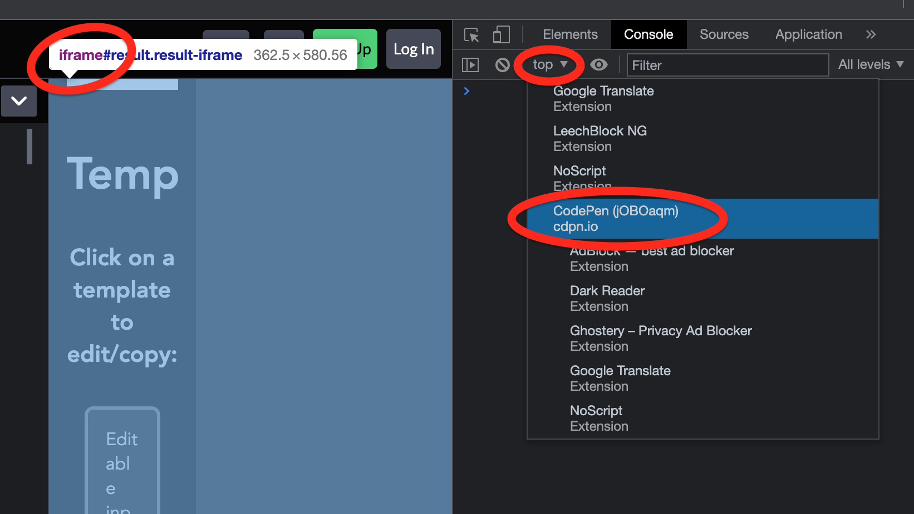
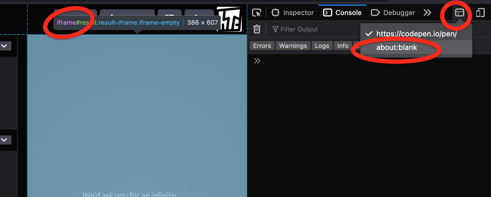

# Learning JavaScript

Miscellaneous practice code in JS.

Just one of the things I'm learning. <https://github.com/hchiam/learning>

<https://random-code-tips.surge.sh>

## Broaden JavaScript knowledge

https://javascript.info/

e.g.:

- https://javascript.info/weakref-finalizationregistry
- https://javascript.info/proxy
- https://javascript.info/currying-partials

### ReqBin - test API endpoints by making API requests

https://reqbin.com/ - also shows a bunch of example requests like GET with bearer token auth header, or Curl/JS/Python/PHP/REST/POST/JSON/POST/PATCH/PUT/DELETE

https://reqbin.com/json-formatter

https://reqbin.com/json-formatter

## How to Run .js Files Using Terminal/CommandLine:

Make sure to include console.log("output text here");

    node filename.js

## Learn about Modern ES6 JS Features

ES6 (ECMAScript 2015) started in **2015**, with yearly additions after that: https://www.w3schools.com/js/js_versions.asp

<https://stackoverflow.blog/2019/09/12/practical-ways-to-write-better-javascript>

Also note the stuff around the default values for function arguments here: <https://devhints.io/es6?ref=devawesome.io>

[Support Both Legacy JS and Modern JS Without Slowing All Browsers](https://codepen.io/hchiam/pen/mdWGLNE)

## Bonus

### Automatically format your code upon save

In VSCode: use the [Prettier](https://marketplace.visualstudio.com/items?itemName=esbenp.prettier-vscode) extension, and then in VSCode > Code > Preferences > Settings > search for "Format on save" > turn it on with the checkbox

Now it'll automatically format your code, just like the built-in stuff for [Golang](https://github.com/hchiam/learning-golang).

### Get immediate feedback on code errors and style

To automatically re-run a [.js file](https://github.com/hchiam/learning-js/tree/master/more-like-interview-questions) and the test cases in it whenever you edit that file, copy the .js code into [`index.js`](https://github.com/hchiam/learning-eslint-google/blob/master/index.js) in my [ESLint repo](https://github.com/hchiam/learning-eslint-google) and do the setup so you can run this command just once:

```bash
nodemon -x 'npm run lint; node index.js'
```

**_Or_** `nodemon -x 'npm run lint; npm run test; node index.js'`

**_Or_** `nodemon -x 'jest lowestIndexSameAsValue.test.js'` for example, to re-run the tests just for one file.

This works just like [`rerun` for Python](https://github.com/hchiam/learning-python/blob/master/README.md#run-code-linter).

**Alternatively:**

To set up [eslint and jest](https://github.com/hchiam/eslint-and-jest) locally inside this learning-js folder:

```bash
npm install jest --global
npm install # eslint is already listed in package.json for you
npm test # runs scripts test command listed in package.json
```

**_Or_** just run this: [`jest`](https://github.com/hchiam/learning-jest).

**_Or_** to run just a-specific.test.js, run this: `jest a-specific.test.js`.

You can also automatically include code style fixes in your commits with [`lint-staged`](https://github.com/hchiam/learning-lint-staged) set up with `husky`.

### Get code Maintainability Index (MI score)

The MI combines lines of code, cyclomatic complexity, and the Halstead volume metric (i.e. number of variables, operations, decision paths, and lines of code). After you [`npm install -g plato` or `yarn global add plato`](https://github.com/es-analysis/plato), you can get the MI score of your code:

```bash
plato -r -d report index.js
```

Similar to how I use [`radon`](https://github.com/hchiam/learning-python/#maintainability-index-mi-score) for Python code.

### Minify code

Install `minify`:

```bash
npm i minify -g # or: yarn global add minify
minify -v
```

Use `minify`:

```bash
minify minify-this-script.js > minified-script.js
```

### stuff you can do without JS-heavy web frameworks

https://codepen.io/hchiam/pen/ExbmjEP

### Using [`yarn`](https://github.com/hchiam/learning-yarn) instead of `npm`

```bash
yarn # instead of npm install or npm run install
yarn test # instead of npm test
```

Instead of `nodemon -x 'npm run test; node index.js'`, you can do:

```bash
nodemon -x 'yarn test; node index.js'
```

### Service Workers

Learning about them: <https://github.com/hchiam/learning-service-workers>

### A list of useful one-liner utilities

<https://1loc.dev/>

### Interesting [a11y](https://github.com/hchiam/web-accessibility-course-notes)-related JS code

<https://github.com/hchiam/keyboard-focus-trap>

<https://github.com/hchiam/flying-focus>

### More data structures/algorithms

<https://github.com/hchiam/learning-splay-tree>

<https://github.com/hchiam/learning-b-tree>

<https://github.com/hchiam/learning-skip-list>

<https://github.com/hchiam/learning-bloom-filter>

<https://github.com/hchiam/learning-union-find>

<https://github.com/hchiam/learning-suffix-tree>

<https://github.com/hchiam/learning-lzw>

### Chrome dev tools tricks for more productive debugging

<https://www.youtube.com/watch?v=hdRDTj6ObiE>

<https://blog.bitsrc.io/10-tips-to-improve-productivity-using-chrome-dev-tools-7918fc8203f3>

and tips like this: <https://umaar.com/dev-tips/15-dollar-zero>

`$_` = previous value

`$0`, `$1`, `$2`, `$3`, `$4` = the last 5 DOM elements you clicked on in the Elements tab

`$('some_selector')` = shortform for `document.querySelector('some_selector')`

`$$('some_selector')` = shortform for `document.querySelectorAll('some_selector')`

`$(`some_selector`, ancestorElement)` or `$('some_selector', $0)`

`$x('some_x_path')` = XPath

`inspect($('some_selector')[0]);` jumps to Elements panel (jQuery not required for that `$`). Works in Firefox too.

`queryObjects(YourConstructor)` = all objects created by `YourConstructor`

`getEventListeners($0)` = event listeners on the element you last clicked on in Elements tab

`monitorEvents(element, eventName)` = prints captured events

`unmonitorEvents(element)`

`monitor(functionName)` = prints function call with arguments, and also output

`unmonitor(functionName)`

`table()` (shortcut in Chrome) = `console.table()`

- ```js
  console.table([
    { a: 1, c: "hi" },
    { a: 3, b: 2 },
  ]);
  /**
   * (index)  a     c     b
   * 0        1     'hi'
   * 1        3           2
   */
  ```

`clear()` = `console.clear()`

`keys()` = `Object.keys()`

`values()` = `Object.values()`

`copy()` = copies to clipboard any value/object/element inside it.

More: https://developers.google.com/web/tools/chrome-devtools/console/utilities#geteventlisteners

### Edit any website (temporarily on the client side)

Enter this into the console log in dev tools: `document.designMode='on'`

### Read a file

In the browser:

- https://github.com/hchiam/learning-js/blob/master/read-text-file.js or
- https://github.com/hchiam/learning-js/blob/master/read-json-file.js

In the console terminal CLI:

- https://github.com/hchiam/learning-nodejs/blob/master/README.md#read-a-local-file-via-console-cli

### Compare JSON files

https://codepen.io/hchiam/pen/RwXqxwZ
- edited
- deleted
- added

### Get a lot of the functions and jQuery event listeners in a script string:

https://github.com/hchiam/getFunctions

### Support modern browsers and older browsers (like IE11) at the same time

```html
<!-- No need for special server setup or user agent sniffing! -->
<script type="module" src="modern.js"></script>
<script nomodule src="legacy.js"></script>
<!-- https://www.youtube.com/watch?v=cLxNdLK--yI -->
```

### Bookmarklets

Only use them after you read and understand the contents of each bookmarklet!

https://en.wikipedia.org/wiki/Bookmarklet

https://github.com/hchiam/learning-js/tree/master/bookmarklets#bookmarklets

### `this` keyword in old-school functions vs the newer arrow functions

`this` in `function()` = caller. Useful if you want `this` to change to whatever calls your one function.

`this` in `() => {}` = owner. Useful if you want `this` to always be the creator of the function. I think _nested_ arrow functions also pass along `this`, which you might like.

```js
// https://www.freecodecamp.org/news/the-difference-between-arrow-functions-and-normal-functions/
const obj = {
  a: () => {
    console.log(this);
    console.log(
      `"this" will be whatever "this" was before the function was created`
    );
  },
  f: function () {
    console.log(this);
    console.log(`"this" will be the current object that contains the function`);
  },
};
obj.a();
obj.f();
```

### CJS vs MJS/ESM/ES6M vs all the other types of JavaScript modules syntax

- ESM = `import` and `export`. Simplest, async, tree-shakeable, but not universally compatible.
- UMD = works everywhere, is more of a pattern of fallbacks, usually the fallback when ESM fails.
- CJS = `require` and `module.exports`, sync, good for BE, commonly seen for node stuff.
- AMD = `define`, async, good for FE, confusing compared to CJS.

Read later:

https://www.sitepoint.com/understanding-es6-modules

https://stackoverflow.com/a/46677972

https://dev.to/iggredible/what-the-heck-are-cjs-amd-umd-and-esm-ikm

https://hacks.mozilla.org/2018/03/es-modules-a-cartoon-deep-dive/

### [Priority queue](https://github.com/datastructures-js/priority-queue) which can be used as a min heap or max heap

```js
// in CJS syntax:
const {
  MinPriorityQueue,
  MaxPriorityQueue,
} = require("@datastructures-js/priority-queue");
```

or

```js
// in ESM syntax:
import {
  MinPriorityQueue,
  MaxPriorityQueue,
  PriorityQueueOptions, // queue options interface
  PriorityQueueItem, // queue item interface
} from "@datastructures-js/priority-queue";
```

API usage example:

```js
const pqAsHeap = new MinPriorityQueue();
pqAsHeap.enqueue(num);
pqAsHeap.dequeue().element;
pqAsHeap.size();
pqAsHeap.front().element;
```

### add [type checking even in JS files](https://code.visualstudio.com/docs/nodejs/working-with-javascript#_type-checking-javascript), no config necessary (in VSCode):

Just add this comment to the top of your JS file:

```js
// @ts-check
```

### Scope console log scripts in DevTools to an iframe or other environment:

Chrome:



Firefox:



### Regex and ReDoS security

- avoid evil RegEx, avoid exponential backtracking, avoid ReDoS: https://owasp.org/www-community/attacks/Regular_expression_Denial_of_Service_-_ReDoS

### Regex cheatsheet

https://developer.mozilla.org/en-US/docs/Web/JavaScript/Guide/Regular_Expressions/Cheatsheet
- `x(?=y)` = lookahead _(AKA **positive** lookahead, in contrast to negative lookahead)_ = "match x if followed by y"
- `x(?!y)` = **negative** lookahead = "match x if NOT followed by y"
- `(?<=y)x` = lookbehind _(AKA **positive** lookbehind, in contrast to negative lookbehind)_ = "match x if preceded by y"
- `(?<!y)x` = **negative** lookbehind = "match x if NOT preceded by y"
- `(?:x)` = **noncapturing** group = "match x but don't remember the group"
- `(?<Name>x)` = capture group with name `Name`
- `\n` = reference to the nth capture group match (count the left brackets)
- `\k<Name>` = reference to the capture group with name `Name` (note: `\k` is not some variable, it's literally like replacing the "`?`")
- `^` = start
- `$` = end
- `x*` = 0 or more times (mnemonic: `*` looks more like a 0 than `+` does, and `*0` changes a number, while `*1` doesn't)
- `x+` = 1 or more times (mnemonic: `+` looks more like a 1 than `*` does, and `+1` changes a number, while `+0` doesn't)
- `x?` = 0 or 1 time = "optionally exists"
- `x{n}` = n times
- `x{n,}` = n or more times
- `x{n,m}` = n to m times, inclusive
- `x*?`, `x+?`, `x??`, `x{n}?`, `x{n,}?`, `x{n,m}?` = match non-greedily = "match minimally", e.g. `/<.*?>/` only matches `<a>` instead of `<a></a>` entirely.
- `\b` = "word boundary" (note: `/\w\b\w/` can't ever matche anything, but `/\w\b\W\w/` can)
    - likely useful as: `/\bword\b/g` (replace `word` with your word or word pattern)
- `[\b]` = backspace
- `\xhh` = character with 2 hexadecimal digits
- `\uhhhh` = UTF-16 character with 4 hexadecimal digits
- `\u{hhhh}`, `\u{hhhhh}` (with `u` flag) = Unicode character with 4/5 hexadecimal digits
    - `'\u{2713}' === '\u2713'` but can include other symbols than numbers in brackets

My applied example: regex to automatically group digits with spaces in input boxes:
- https://codepen.io/hchiam/pen/yLrjgrV (4 digits from left to right, or from right to left)
- `.split(/(\d{4})/g)` --> `.replace(/\D/g,'').split(/(\d{4})/g).filter(x=>x).join(' ')`
    - `1234567890` --> `1234 5678 90`

### Web Locks

```js
// multiple browser tabs can try to access a lock named my_resource, but only one will be processed at a time (queued)
// also scoped to origins (https://example.com is different from https://example.org:8080)
navigator.locks.request("my_resource", async (lock) => {
  // lock acquired

  // do stuff
  await do_something();
  await do_something_else();

  // lock released
});
```

Note: deadlocks can still happen if, say, multiple locks are requested out-of-order.

More details/options: https://developer.mozilla.org/en-US/docs/Web/API/Web_Locks_API

### `import` vs `import()`

[Static `import`](https://developer.mozilla.org/en-US/docs/Web/JavaScript/Reference/Statements/import):

```js
import { something as aliasedName } from "some-module.js";
```

[Dynamic `import()`](https://developer.mozilla.org/en-US/docs/Web/JavaScript/Reference/Operators/import):

```js
import("/some-module.js").then((aliasedName) => {});
// or:
const { default: myDefault, foo, bar } = await import("/some-module.js");
// or just:
await import("/some-module.js"); // like if you just want its side-effects
```

### D3 `<path>`/svg `.click()` note

```js
/** Because simply using d3Element.click() or jQuery $(d3Element).click() doesn't work: https://stackoverflow.com/questions/9063383/how-to-invoke-click-event-programmatically-in-d3 */
function triggerD3PathClick(d3Element) {
  const event = new MouseEvent("click");
  d3Element.dispatchEvent(event);
}
```

### xpath

Here's an xpath to get only the English entry part of a Wiktionary page:

```js
$x("//h2[span[text()='English']] | //h2[span[text()='English']]/following-sibling::*[preceding-sibling::h2[1][span[text()='English']] and not(self::h2)]")
// use | so you can include the English h2 in the selection
// you need the [1] so you stop selecting elements after the next h2
// you need self:: in not(self::h2) to avoid including the next h2
```

Building on that, here's an xpath to get just the etymology and definition(s) (`<p>` or `<ol>`) of the English part of a Wiktionary page:

```js
$x("//h2[span[text()='English']]/following-sibling::*[self::p or self::ol][preceding-sibling::h2[1][span[text()='English']]]")
```

### Event listener `event.target` vs `event.currentTarget` vs `event.relatedTarget`

https://stackoverflow.com/a/10086501
- `currentTarget` = listening element (e.g. the individual button that has the click event listener fired on it)
- `target` = triggering element (i.e. maybe the button, or maybe the i or span you actually clicked on inside of the button) 

https://developer.mozilla.org/en-US/docs/Web/API/FocusEvent/relatedTarget
- `relatedTarget` = element focused _to_ for `blur`, focused _from_ for `focus`; similar idea for `focusin` and `focusout` and `mouse`(...)/`drag`(...) events, but note that `relatedTarget` may be `null` for non-focusable elements or for security reasons like tabbing out of a page.

### operator precedence reference

for example, `&` is evaluated before `&&` before `||`: https://developer.mozilla.org/en-US/docs/Web/JavaScript/Reference/Operators/Operator_precedence#table

### example of debugging with chrome dev tools and fixing code base

"Optimizing INP: A deep dive": https://youtu.be/cmtfM4emG5k

### weird timing behaviour with `try` `catch` `finally`

https://jakearchibald.com/2021/last-return-wins/

The `finally` console log prints `'two'` "before" the `return 'three'`:

```js
// this code prints out 'one', 'two', 'three', 'four':

function finallyTest() {
  try {
    console.log('one');
    return 'three';
  } catch (err) {
    console.log('error');
  } finally {
    console.log('two');
  }
}

console.log(finallyTest());
console.log('four');
```

This might cause unexpected timing issues if you're not aware of this. (Also, `​.finally` behaves differently for `Promise`s.)

More notes on `Promise`s and `async`/`await`: https://www.joshwcomeau.com/javascript/promises/

### Example use of JS animation `ScrollTimeline` that goes dynamically beyond what CSS can do

https://web.dev/articles/building/a-tabs-component#animation

### tag function of template literals string, raw

https://developer.mozilla.org/en-US/docs/Web/JavaScript/Reference/Global_Objects/String/raw

```js
var thisisTrue = String.raw`C:\folder\path\file.js` === `C:\\folder\\path\\file.js`;
```

```js
// using new RegExp with String.raw and variable:
var x = 'Street';

console.log(new RegExp(`(\\d+) ${x}`).exec('123 Street')[1]);
// '123'
console.log(new RegExp(String.raw`(\d+) ${x}`).exec('123 Street')[1]);
// '123'
```

### space characters

You might know about `' '` and `&nbsp;`, but did you know about `&puncsp;` (`'\u2008'`) which takes up space but is able to wrap? there's even more Unicode characters: https://stackoverflow.com/questions/8515365/are-there-other-whitespace-codes-like-nbsp-for-half-spaces-em-spaces-en-space You can also do this in JS:
    - `'\u{2713}' === '\u2713'` but can include other symbols than numbers in brackets

```js
'a'.padEnd(10, '\u2008'); // U+2008 is Unicode for &puncsp;
```

### using JS to set CSS styles

```js
element.style.color = 'red'; // this does something
element.style.color = 'red !important'; // WARNING: this won't do anything! it won't even change the color!
element.style.setProperty('color', 'red', 'important'); // this works if you want to include !important
```

### width and height of HTML elements in CSS/JS

https://stackoverflow.com/questions/21064101/understanding-offsetwidth-clientwidth-scrollwidth-and-height-respectively
- offsetWidth, offsetHeight (includes padding and border)
    - clientWidth, clientHeight (like offsetWidth and offsetHeight but without the padding or border)
- CSS width, CSS height
- scrollWidth, scrollHeight (doesn't include padding or border, but does include overflow content)

### remove initial "1." text node without replacing children HTML:

```js
// if first child (likely textNode) starts with "#.", then remove that child:
if (/^\d+\.$/.test(element.childNodes[0].nodeValue)) {
    element.childNodes[0].remove();
}
```

### `Set` methods

- https://web.dev/blog/set-methods?hl=en
    - `aSet.intersection(bSet)`
    - `aSet.union(bSet)`
    - `firstSet.difference(notInSecondSet)`
    - `inAXorB = aSet.symmetricDifference(bSet)`
    - `fours.isSubsetOf(events)`
    - `evens.isSupersetOf(fours)`
    - `haveNothingInCommon = primes.isDisjointFrom(squares)`

## `document.implementation.createHTMLDocument()`:

- https://www.youtube.com/watch?v=surh_D8CU9A&list=PLNYkxOF6rcIAEVKJ98bDkQRkwvO4grhnt&index=11
- https://developer.mozilla.org/en-US/docs/Web/API/DOMImplementation/createHTMLDocument#examples

```js
output.innerHTML = '';
const doc = document.implementation.createHTMLDocument(); // <-- a key part
doc.write('<p>list:</p><ul><li>');
output.append(doc.body.firstChild); // <-- a key part
// then to keep appending:
let previousLength = 0; // until browser stream chunk implementation detail changes
for await (const chunk of stream) {
  const newContent = sanitized(chunk.slice(previousLength)) + '<li>';
  previousLength = chunk.length;
  doc.write(newContent); // <-- a key part for streaming instead of replacing all
}
doc.write('</ul>');
```

which can more performant/streamable than this:

```js
output.innerHTML = '<p>completely replacing everything every time</p>';
```

You can see the difference in Chrome DevTools with Ctrl+Shift+P > Rendering > Paint flashing. 

## communicate data between tabs and calling functions on the other tab

- requires the first tab opening the second tab in js code

https://stackoverflow.com/questions/1366483/javascript-sharing-data-between-tabs/1367357#1367357

first tab: (opens second tab in js code)

```js
var child_window = window.open( ...params... );
var var_from_child = child_window.some_var;
child_window.someFunction( 'with', 'these', 'params' )
```

second tab: (opened by first tab in js code)

```js
var parent_window = window.opener;
var var_from_parent = parent_window.some_var;
parent_window.someFunction( 'with', 'these', 'params' )
```
