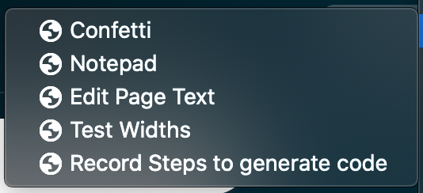

# Bookmarklets

Only use a bookmarklet after you read and understand its code!

More info: https://en.wikipedia.org/wiki/Bookmarklet

An alternative to bookmarklets are [Chrome Snippets](https://developer.chrome.com/docs/devtools/javascript/snippets/).

## Tips for converting from normal JS to bookmarklet

- wrap it in `javascript:(function(){` … `})();`
- encode `%` as `%25`, so console.log `%c` becomes `%25c`
- remove comments that use `//`

Or just use https://bookmarklet-generator.surge.sh

## Minimizing diffs between the JS version and bookmarklet version

- you can keep the wrapping `javascript:(function(){` … `})();` in the JS (still works in browser console)
- change `%25c` back to `%c` inside console.log
- (but you’ll likely want to put back the comments)

## There's also the possibility of HTML

For example `data:text/html,<html contenteditable></html>`: https://github.com/hchiam/learning-js/blob/main/bookmarklets/notepad.html

## Enable running bookmarklets quickly with keyboard shortcuts

Chrome currently includes bookmarks (and bookmarklets) in search suggestions by default. Hit `Ctrl+L` -> type part of the bookmarklet name -> hit Enter to run.

For Firefox: `Ctrl+B` -> type a search -> tab to bookmarklet -> spacebar to select -> Enter to run.

## Example bookmarklet project

https://github.com/hchiam/basic-page-editor-bookmarklet
