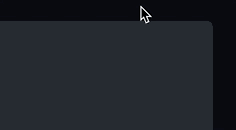

<!-- View on GitHub to get the convenient copy-to-clipboard button: -->

# Hover over the code to see the copy-to-clipboard button:



```js
javascript:(function(){
checkForModernJSThatBreaksIE(%22targetJsFileName%22);

function checkForModernJSThatBreaksIE(targetJsFileName) {
  var jsFileUrl = document.querySelector(
    'script[src*=%22' + targetJsFileName + '%22]'
  ).src;
  console.log(jsFileUrl);
  fetch(jsFileUrl)
    .then(function (x) {
      return x.text();
    })
    .then(function (text) {
      var lines = text.split(%22\n%22);
      findThing(lines, %22`%22);
      findThing(lines, %22const %22);
      findThing(lines, %22let %22);
      findThing(lines, %22=>%22);
      findThing(lines, %22...%22);
      console.log(jsFileUrl);
      alert(%22Note: only checks for \n\n`\nconst\nlet\n=>\n...\n%22);
    });

  function findThing(lines, thing) {
    for (let i in lines) {
      const line = lines[i];
      if (line.includes(thing)) {
        console.log(%22line%22, Number(i) + 1, ' has %22', thing, '%22:\n', line, %22\n%22);
      }
    }
  }
}

})();
```

https://github.com/hchiam/learning-js/blob/main/bookmarklets/checkForModernJSThatBreaksIE.js
